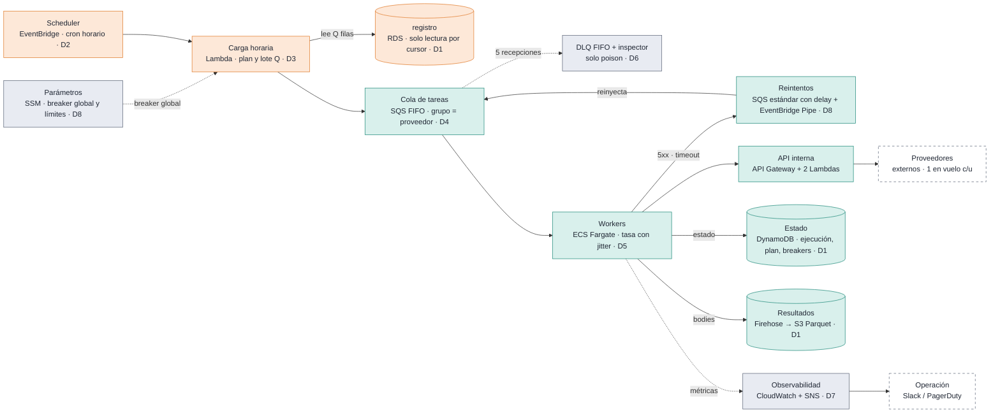
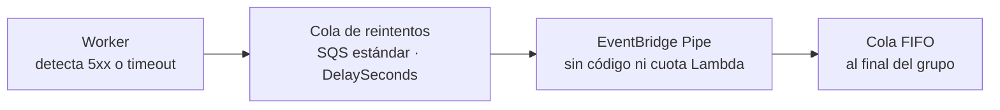
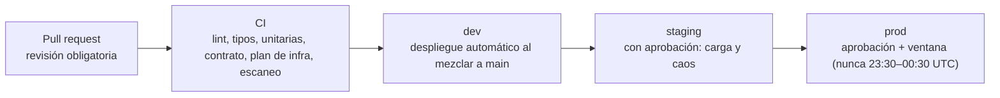
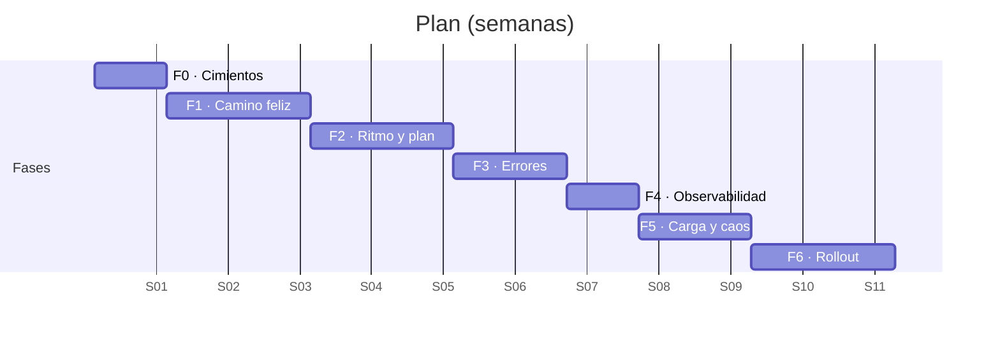

# Ejecutor diario de consultas

Arquitectura en AWS para consultar 1 M × N registros al día, distribuidos, sin concurrencia por proveedor, con manejo de errores y seguridad por diseño.

1. [Diagrama de arquitectura](#1--diagrama-de-arquitectura)
2. [Justificación de decisiones](#2--justificación-de-decisiones)
3. [Ciclo de vida de desarrollo](#3--ciclo-de-vida-de-desarrollo)
4. [Plan de desarrollo](#4--plan-de-desarrollo)
5. [Cierre](#cierre)
6. [Anexo · Demo local (este repositorio)](#anexo--demo-local)

---

## Contexto

### Escala

| Cifra | Qué es |
|---|---|
| **1 M** consultas/día | caso base del enunciado |
| **100 M** consultas/día | objetivo de diseño (N = 100) |
| **2** Lambdas por llamada | la API interna paga cada consulta doble |
| **~21 M** consultas/día | techo con la cuota Lambda por defecto |

### Requisitos del enunciado

| Requisito | Detalle |
|---|---|
| **Consulta diaria** | automática y distribuida a lo largo del día |
| **Guardar el resultado** | de cada consulta en una base de datos |
| **Errores** | algunos se reintentan, otros no |
| **Sin concurrencia** | nunca dos consultas a la vez al mismo proveedor |

> **Premisa:** la escala es lineal (1 M × N). Cada cifra del diseño se calcula como múltiplo del caso base; las restricciones reales son la cuota de Lambda compartida y la latencia de la API.

---

## 1 · Diagrama de arquitectura

### Arquitectura



| Capa | Qué hace |
|---|---|
| 🟧 **Carga** | 1 vez por hora, O(lote) |
| 🟩 **Ejecución** | continua, único que consume cuota Lambda |
| ⬜ **Control** | no mueve datos: breakers y parámetros sin deploy |

### Flujo diario

| Momento | Fase | Qué pasa |
|---|---|---|
| **00:00** | Planifica | Estima N (`MAX(id)`, sin `COUNT(*)`), fija Q = N / 22 y encola el primer lote |
| **Cada hora** | Admite o difiere | Si el backlog supera ½ lote o el breaker global está abierto, difiere y reparte; recalcula la tasa |
| **Continuo** | Consume | Workers a tasa objetivo con jitter; 1 en vuelo por proveedor; estado y body persistidos |
| **22:00–24:00** | Absorbe | 2 h reservadas para reintentos y atrasos; lo que no entra se declara no ejecutado |

**Qué escala con N**

| Componente | Comportamiento |
|---|---|
| **Carga** | O(N / 22) por invocación; a N = 1.000 se encadena por autoinvocación |
| **Cola** | nunca más de ~1,5 lotes; in-flight ≤ `MAX_CONCURRENT_PROVIDERS` |
| **Workers** | acotados por la cuota Lambda, no por N |
| **DynamoDB · S3** | lineal: ~1 escritura por consulta, Parquet por fecha y proveedor |

---

## 2 · Justificación de decisiones

### Requisitos

| Requisito | Cómo se cumple | Decisiones |
|---|---|---|
| **Diaria y distribuida** | Plan a las 00:00 y un lote por hora con admisión según backlog; los workers consumen a tasa constante con jitter, sin ráfagas. | D2 · D3 · D5 |
| **Guardar el resultado** | Estado por registro y día en DynamoDB con escritura condicional (idempotente); bodies a S3 en Parquet vía Firehose. | D1 |
| **Errores reintentables y no** | 4xx es un resultado final; 5xx y timeout esperan en una cola estándar con delay y vuelven a la FIFO (máx. 4); 429 pausa al proveedor; breakers. | D6 · D8 |
| **Sin concurrencia por proveedor** | SQS FIFO con grupo = proveedor: la infraestructura no entrega otro mensaje del grupo hasta borrar el anterior. Sin locks propios. | D4 · D5 |

### Decisiones D1–D4

#### D1 · Datos
**DynamoDB para el estado; Firehose → S3 Parquet para los bodies; registro sigue en SQL, solo lectura**
- **Por qué:** 100 M/día ≈ 3.500 writes/s y 500 GB/día: un writer SQL no entra y los bodies en DynamoDB costarían ~20×
- **Descartado:** RDS / Aurora para resultados

#### D2 · Reloj
**EventBridge Scheduler con un cron horario en UTC**
- **Por qué:** Costo ≈ $0, reintentos y DLQ de la invocación; la carga es idempotente si una hora se pierde
- **Descartado:** Un schedule por registro · Step Functions

#### D3 · Carga
**Lambda horaria: estima N, fija Q = N / 22 y lee por cursor**
- **Por qué:** Da una palanca intermedia ante una API compartida que sufre: no entregar el siguiente lote
- **Descartado:** Encolar el día entero a las 00:00 · poller por minuto

#### D4 · Cola
**SQS FIFO high-throughput, grupo = proveedor**
- **Por qué:** La garantía de 1 en vuelo la da la infraestructura; pausar un proveedor = extender la visibility
- **Descartado:** SQS estándar + locks · una cola por proveedor · Kinesis

### Decisiones D5–D8

#### D5 · Workers
**ECS Fargate (Spot + base on-demand), HTTP asíncrono**
- **Por qué:** Trabajo I/O-bound y fuera de la cuota Lambda que usa la API; la flota acotada es la garantía de cuota
- **Descartado:** Lambda + SQS (cobra la espera, compite por cuota) · EKS

#### D6 · DLQ
**DLQ FIFO solo para mensajes poison (5 recepciones)**
- **Por qué:** Un mensaje ahí significa una sola cosa, bug o dato roto: la alarma es accionable
- **Descartado:** DLQ como cola de reintentos

#### D7 · Observabilidad
**CloudWatch + SNS con métricas agregadas**
- **Por qué:** Métricas por proveedor costarían ~$60k/mes; el detalle por proveedor vive en DynamoDB
- **Descartado:** Prometheus + Grafana · Datadog

#### D8 · Errores
**Clasificar en el worker; reintentos en cola estándar con delay que un EventBridge Pipe devuelve a la FIFO**
- **Por qué:** La FIFO no admite delay por mensaje: esperar fuera de ella no bloquea al proveedor
- **Descartado:** Visibility como backoff · reintento inline · backoff sin jitter

### Manejo de errores

| Respuesta | Estado | Acción | ¿Breaker? |
|---|---|---|---|
| 2xx | `done` | Guarda resultado y borra el mensaje | Resetea |
| 400 · 401 · 403 · 404 · 422 | `failed_permanent` | Se guarda igual: es un resultado, no se reintenta | No |
| 429 | sin cambio | Pausa el grupo por `Retry-After` (30 s por defecto) | No |
| 5xx · timeout de cadena | `retry` | Espera en cola con delay y vuelve al final del grupo (máx. 4) | Sí |
| Excepción del worker | sin cambio | Vuelve por visibility; tras 5 recepciones va a la DLQ | No |

| Mecanismo | Regla |
|---|---|
| **Backoff** | espera = random(0, min(15 min, 30 s × 2^intento)). Tope de 15 min = máximo `DelaySeconds` de SQS; jitter completo. |
| **Breaker por proveedor** | 5 fallos seguidos → pausa su grupo 2 min; una sonda decide si cierra o duplica la pausa (tope 30 min). |
| **Breaker global** | > 50 % de fallos y ≥ K proveedores fallando en 2 min → los workers dejan de recibir hasta que la API vuelve. |

### Reintentos sobre SQS FIFO



| Paso | Qué hace |
|---|---|
| **Worker** | Marca `retry` en DynamoDB y borra el mensaje: el proveedor sigue con su próximo registro |
| **Cola de reintentos** | Retiene el mensaje el tiempo del backoff (≤ 15 min) sin ocupar al proveedor |
| **EventBridge Pipe** | Lo envía a la FIFO con grupo = proveedor y dedup por registro, fecha e intento |
| **Cola FIFO** | Se ejecuta cuando el grupo lo alcanza: la espera real es ≥ backoff |

| Alternativa | Por qué no (o cuándo sí) |
|---|---|
| Extender la visibility en la FIFO | Bloquea al proveedor durante toda la espera. Se usa solo donde pausar es lo buscado: 429 y breaker |
| `DelaySeconds` en la FIFO | Solo existe a nivel de cola, no por mensaje |
| Lambda reinyector | Consume la cuota Lambda que comparte con la API; el Pipe hace lo mismo sin código |
| EventBridge Scheduler (one-off) | Para esperas de más de 15 min. Hoy no hace falta: con 4 intentos el backoff máximo es 8 min |

> **Idempotencia:** la cola estándar puede duplicar; la dedup de la FIFO y la escritura condicional (`attempts = intento`) lo absorben.

### Seguridad

| Área | Medidas |
|---|---|
| **Identidad** | Un rol IAM por componente, mínimo privilegio · Sin llaves estáticas: roles de task y Lambda · Hacia la API: IAM (SigV4) o token en Secrets Manager con rotación |
| **Red** | Subnets privadas, sin NAT ni salida a internet · VPC endpoints para todos los servicios AWS · API Gateway privado, solo desde la VPC |
| **Cifrado** | KMS con llaves propias: colas, estado y resultados · TLS 1.2+ en todo tránsito · S3 rechaza tráfico sin TLS y objetos sin KMS |
| **Datos sensibles** | Bodies en bucket dedicado, sin acceso público, lectura auditada · Campos sensibles enmascarados antes de guardar · Logs sin bodies ni credenciales: solo ids y códigos |
| **Entradas** | Solo se llama a la URL base de la API interna · `endpoint` validado contra allowlist (evita SSRF) · Usuario de base con solo `SELECT` sobre registro |
| **Auditoría** | CloudTrail con data events de S3 y KMS · GuardDuty, Security Hub y AWS Config · Imágenes y dependencias escaneadas en CI |

### Costos y escala

Costo mensual a 100 M consultas/día (USD, punto medio):

| Componente | USD/mes |
|---|---:|
| API interna (2 Lambdas) | $27.500 |
| DynamoDB | $6.000 |
| Firehose + S3 | $2.000 |
| SQS FIFO | $1.800 |
| Fargate | $68 |
| VPC endpoints | $60 |
| CloudWatch | $30 |

| Cifra | Qué es |
|---|---|
| **~$200–270** | infraestructura propia al mes a 1 M/día |
| **~$10k** | infraestructura propia al mes a 100 M/día |
| **~21 M/día** | techo con la cuota por defecto (370 proveedores en vuelo); N = 100 exige pedir ampliación |

> La palanca de ahorro es el número de llamadas facturables: idempotencia, reintentos acotados y breakers.

### Riesgos y supuestos

| Riesgo | Mitigación |
|---|---|
| Cuota Lambda compartida: techo ~21 M/día | `MAX_CONCURRENT_PROVIDERS` derivado de la cuota; alarma al 80 %; pedir ampliación antes de escalar |
| La API se degrada durante horas | Admisión por backlog, tasa recalculada y 2 h reservadas; lo que no entra se declara no ejecutado |
| Caída general de la API | Breaker global por correlación antes de abrir miles de breakers (límite FIFO de 20.000 in-flight) |
| La API no expone códigos honestos | Pedir el header `X-Upstream-Status`; mientras tanto, 502/500 sin header cuentan como 5xx |
| Doble llamada si un worker muere | Inherente a at-least-once: escritura condicional en DynamoDB; se declara |
| Un proveedor no cabe en el día | Se cuenta como deadline por proveedor y se negocia volumen o latencia |

> **Supuestos:** registro con PK `id` creciente · 1 request en vuelo por proveedor · latencia de 1–2 s y timeout de cadena de 29 s · body de 1–5 KB · el día se corta en UTC

---

## 3 · Ciclo de vida de desarrollo

### Ciclo de vida



| Área | Prácticas |
|---|---|
| **Repositorio** | Monorepo: worker (TypeScript), lambdas (Python), infra (CDK/Terraform) · Paquete de contratos compartido: mensaje, máquina de estados y tabla de errores |
| **Entornos** | dev: mock de la API con fallos inyectables, 10 k filas · staging: 1 M filas y la misma cuota que prod · prod: datos reales, registro en solo lectura |
| **Despliegue y rollback** | Worker en rolling sin perder lo en vuelo · Lambdas por alias versionado · Rollback = volver el alias o la task definition; esquemas solo aditivos |

### Pruebas y rollout

**Pruebas**

| Tipo | Qué cubre |
|---|---|
| **Unitarias** | limitador con jitter, clasificación, Q y tasa, admisión, backoff, breakers |
| **Integración (dev)** | un día completo contra el mock: todo termina en `done` o `failed_permanent`, DLQ vacía |
| **Carga (staging)** | 1 M y 5 M en un día comprimido; utilización de carriles y costo por consulta |
| **Caos (staging)** | matar tasks, perder la carga horaria, 5xx a uno y a todos, 429, body corrupto |
| **Idempotencia** | reentregar mensajes y reinvocar cargas: nada cambia en DynamoDB |

**Rollout**

1. **Modo sombra** — todo desplegado con tasa 0 y un proveedor sintético
2. **Canario 1 %** — de los proveedores reales durante 2 días
3. **Gradual** — 10 % → 50 % → 100 %, un día entre pasos; avanza si no hay alarmas

> **Cada paso es un cambio de parámetro SSM, no un deploy.** Operación: runbook por alarma, guardia, revisión semanal de deadline y poison, game day trimestral.

---

## 4 · Plan de desarrollo



| Fase | Contenido | Duración |
|---|---|---|
| **F0 · Cimientos** | IaC con IAM, KMS y red privada; CI; mock de la API | 1 sem |
| **F1 · Camino feliz** | carga → FIFO → worker → DynamoDB + S3 | 2 sem |
| **F2 · Ritmo y plan** | plan 00:00, admisión horaria, limitador, autoscaling | 2 sem |
| **F3 · Errores** | clasificación, cola de reintentos, 429, breakers, DLQ | 1,5 sem |
| **F4 · Observabilidad** | métricas, alarmas, breaker global, runbooks | 1 sem |
| **F5 · Carga y caos** | carga, caos, idempotencia, revisión de seguridad | 1,5 sem |
| **F6 · Rollout** | sombra, canario 1 %, gradual hasta 100 % | 2 sem |

> **En paralelo desde F0:** pedir ampliación de cuota Lambda y el header `X-Upstream-Status` (dependen de terceros). Equipo: 2 personas + 1 a tiempo parcial.

---

## Cierre

| | |
|---|---|
| **Distribución** | lotes horarios con admisión y consumo parejo con jitter |
| **Concurrencia** | garantizada por SQS FIFO, no por locks propios |
| **Reintentos** | fuera de la FIFO, con delay: nunca bloquean al proveedor |
| **Resiliencia** | errores clasificados, breakers y DLQ solo para poison |
| **Seguridad** | mínimo privilegio, red privada, KMS y datos sensibles fuera de logs |
| **Escala** | lineal con N; el techo es la cuota Lambda y se gestiona desde el día uno |

---

## Anexo · Demo local

Este repositorio implementa las fases **F0–F3** del plan como una demo que corre end-to-end en local: **Java 21 + Spring Boot 4**, **LocalStack** (SQS FIFO / estándar / DLQ, DynamoDB, S3, SSM) y **PostgreSQL**. Sin deploy real a AWS.

### Mapeo AWS → local

| En el diseño | En la demo | Por qué |
|---|---|---|
| EventBridge cron horario | `@Scheduled(cron)` en el perfil `loader`; `LOADER_CRON` comprime la "hora" a 1 minuto | mismo comportamiento, sin servicio externo |
| Lambda de carga + workers Fargate | **una sola app Spring Boot**, perfiles `loader`, `worker`, `reinjector`, `mockapi`; `docker-compose` levanta la misma imagen por perfil | un build, un jar, separación visible |
| EventBridge Pipe (retry → FIFO) | perfil `reinjector` (`RetryReinjector`): escucha la cola estándar y reenvía a la FIFO con `groupId` = proveedor y `dedupId` = registro#fecha#intento | Pipes no está en LocalStack community |
| Firehose → S3 Parquet | el worker escribe el body JSON directo a S3: `results/date=…/provider=…/id.json` | Firehose no está en LocalStack community; Parquet no aporta a la demo |
| IaC (CDK/Terraform) | `InfraBootstrap` crea colas, tablas, bucket y parámetros SSM al arrancar si faltan | una sola definición sirve a compose y a los tests |
| CloudWatch + SNS | Micrometer → `/actuator/prometheus` (contadores `dqe.calls`, `dqe.loader.*`) + logs | F4 queda fuera de alcance |
| IAM / KMS / VPC / CloudTrail | fuera de alcance local | no ejecutable en LocalStack community |

### Estructura

```
src/main/java/com/arian/dqe/
  contracts/   TaskMessage (mensaje FIFO), ExecutionStatus (máquina de estados)
  infra/       AppProps, AwsConfig (factory SQS: 1 msg/poll, ack manual), InfraBootstrap, Params (SSM)
  loader/      LoaderScheduler (plan 00:00 + admisión horaria), PlanStore (DynamoDB), RegistroRepository (JDBC por cursor)
  worker/      TaskListener, ResponseClassifier, Backoff, RateLimiter, ProviderBreaker, GlobalBreaker, ApiClient, ResultStore
  reinjector/  RetryReinjector (stand-in del Pipe)
  mockapi/     MockApiController (latencia, fallos por proveedor, /chaos, /stats, /health)
infra/postgres/init.sql   tabla registro, 10 k filas / 50 proveedores, usuario solo SELECT
docker-compose.yml        localstack + postgres + mockapi + loader + worker×2 + reinjector
```

### Cómo correr

```bash
./gradlew test                 # unitarios + end-to-end (Testcontainers: LocalStack + Postgres)
docker compose up --build      # demo completa; la "hora" dura 1 minuto
```

Qué mirar mientras corre (`awslocal` = `aws --endpoint-url http://localhost:4566`):

```bash
docker compose logs -f worker                     # record=… provider=… http=… outcome=…
awslocal dynamodb scan --table-name execution --select COUNT
awslocal dynamodb scan --table-name plan          # N, Q, cursor
awslocal dynamodb scan --table-name breaker       # pausas por proveedor
awslocal s3 ls s3://results/ --recursive | wc -l
awslocal sqs get-queue-attributes --queue-url http://localhost:4566/000000000000/tasks-dlq.fifo --attribute-names ApproximateNumberOfMessages
curl -s localhost:8080/stats                      # máximo in-flight por proveedor (debe ser 1)
curl -s -X POST localhost:8080/chaos/down         # dispara el breaker global; /chaos/ok lo deja cerrar
awslocal ssm get-parameter --name /dqe/breaker/global
```

Fallos inyectados en el mock (configurables en `app.mockapi.faults`):

| Proveedor | Respuesta | Resultado esperado |
|---|---|---|
| `p-013` | 500 siempre | 4 reintentos con backoff vía cola estándar → `FAILED_EXHAUSTED`; su breaker abre y duplica la pausa |
| `p-027` | 429 en 2 de cada 3 llamadas | pausa del grupo por `Retry-After`; termina `DONE` |
| `p-042` | 404 | `FAILED_PERMANENT` al primer intento, body guardado igual |
| registro `id = 7` | endpoint fuera de la allowlist | excepción del worker → 5 recepciones → DLQ |

### Qué verifica el test end-to-end

`EndToEndTest` carga un lote (Q = 455 filas), espera que todo termine y afirma:

- 436 `DONE`, 9 `FAILED_PERMANENT`, 9 `FAILED_EXHAUSTED`, 0 `RETRY`; 445 objetos en S3
- DLQ con exactamente 1 mensaje (el poison)
- el mock nunca vio 2 llamadas en vuelo del mismo proveedor
- reentregar un mensaje ya hecho no cambia nada en DynamoDB (idempotencia)

### Seguridad aplicada en la demo

- usuario de base `dqe_ro` con solo `SELECT` sobre `registro`
- el worker solo llama a la URL base configurada; `endpoint` validado contra allowlist antes de salir
- campos sensibles (`taxId`, `email`) enmascarados antes de guardar en S3
- logs con ids y códigos, nunca bodies

### Simplificaciones deliberadas

Marcadas con `// ponytail:` en el código:

- `RetryReinjector` existe solo porque Pipes no está en LocalStack; en AWS es configuración
- breaker global con ventana en memoria por instancia; en AWS es metric math sobre CloudWatch
- la carga difiere sin "repartir" (recalcular Q sobre las horas restantes)
- cualquier 4xx no listado se trata como `failed_permanent`

Fuera de alcance: F4 (alarmas, runbooks), F5 (carga, caos), F6 (rollout), IAM/KMS/VPC, Firehose/Parquet.
